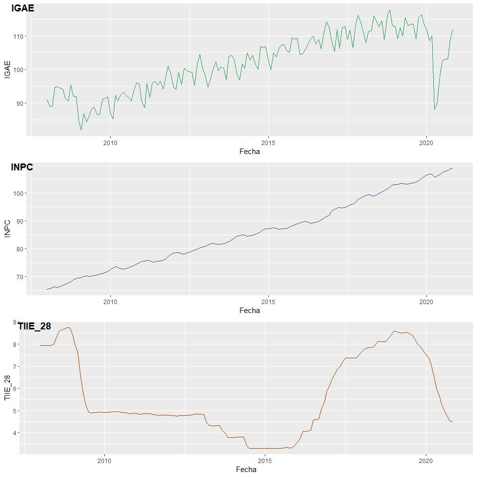
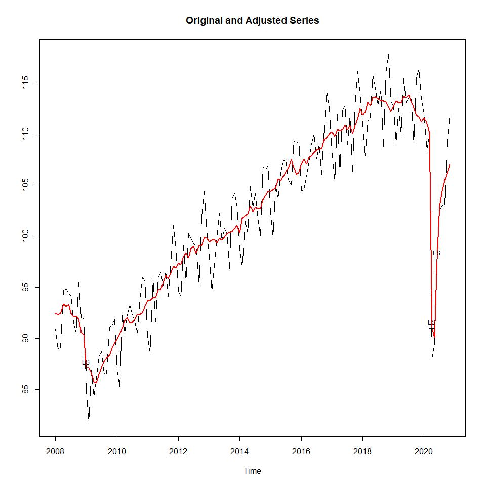
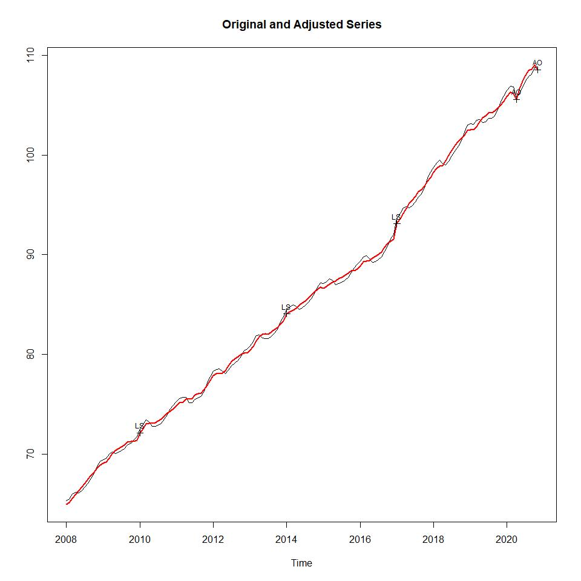
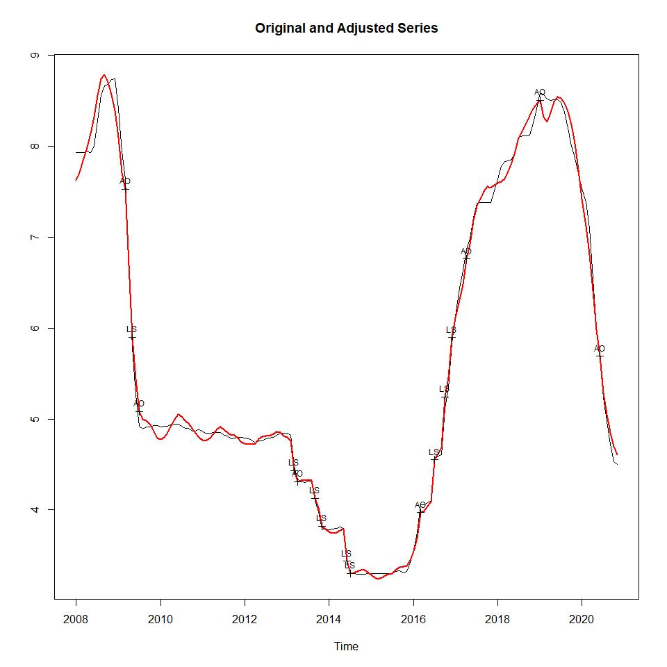
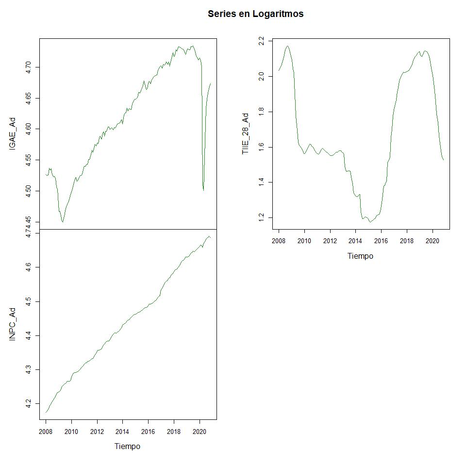
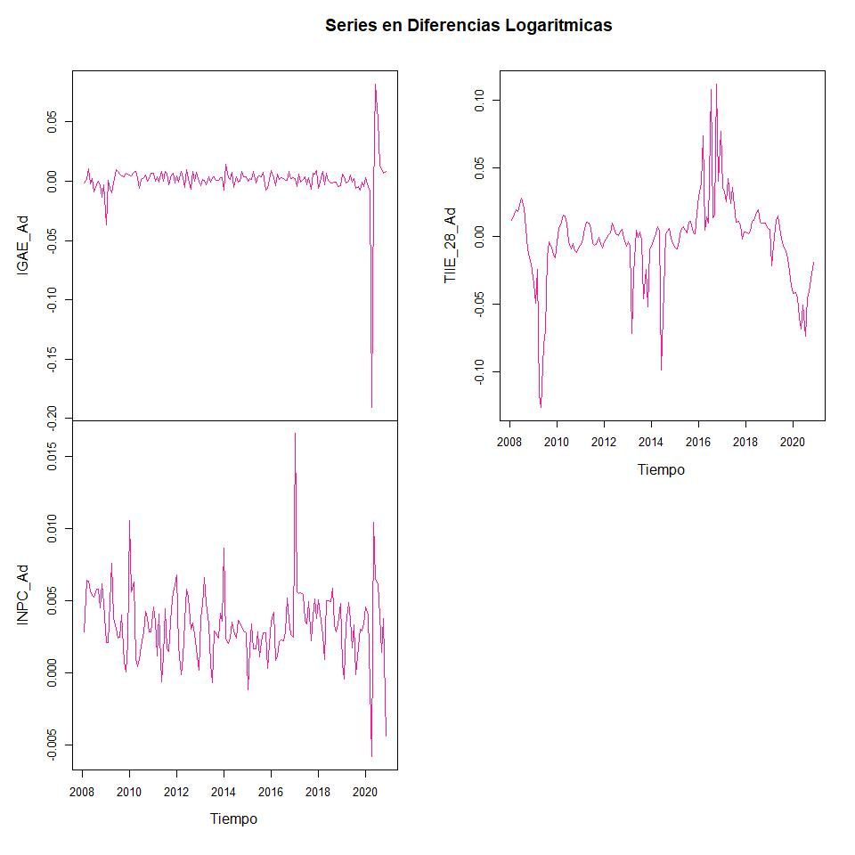
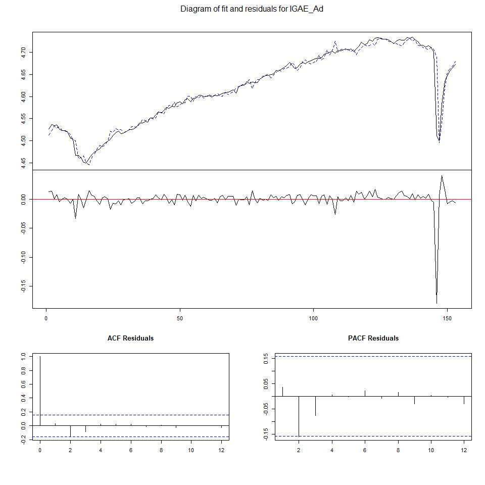
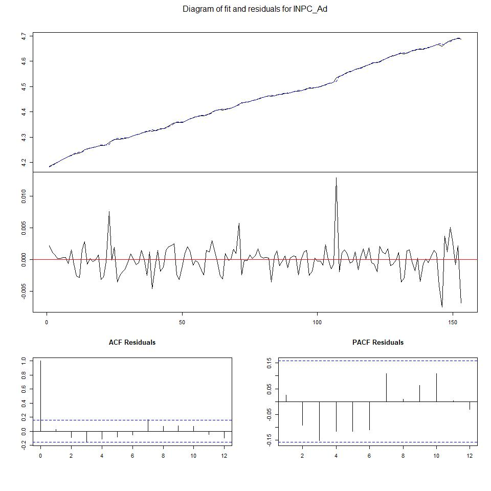
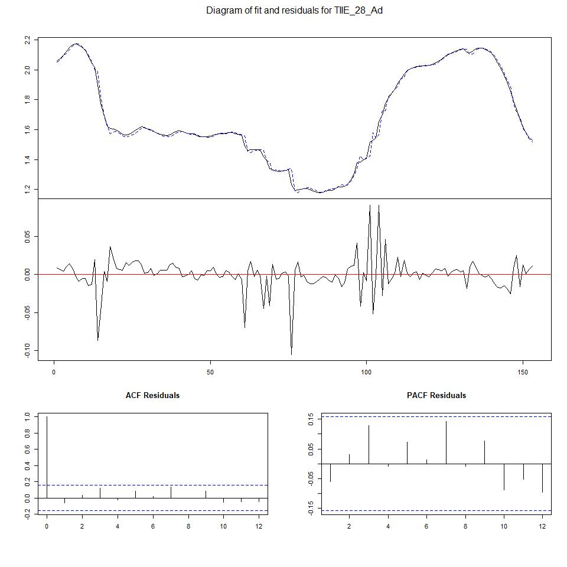
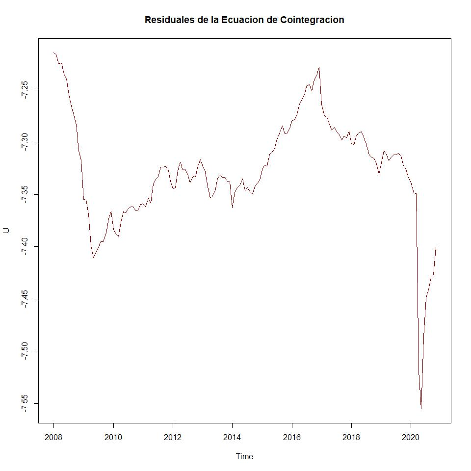

  - [Cointegración del Crecimiento Económico, Inflación y Tasa de
    interés en México
    (2008-2020)](#cointegración-del-crecimiento-económico-inflación-y-tasa-de-interés-en-méxico-2008-2020)
  - [1 Introducción](#introducción)
  - [2 Descripción de los Datos](#descripción-de-los-datos)
  - [3 Prueba de Hipóteis](#prueba-de-hipóteis)
  - [4 Análisis descriptivo](#análisis-descriptivo)
      - [4.1 Preparar ambiente](#preparar-ambiente)
          - [4.1.1 Descripción de los datos
            utilizados](#descripción-de-los-datos-utilizados)
      - [4.2 Conversión a series de
        tiempo](#conversión-a-series-de-tiempo)
          - [4.2.1 IGAE ajustado](#igae-ajustado)
          - [4.2.2 INPC ajustado](#inpc-ajustado)
          - [4.2.3 TIIE\_28 ajustado](#tiie_28-ajustado)
      - [4.3 Desestacionalización](#desestacionalización)
          - [4.3.1 Agregando nuevas series
            desestacionalizadas:](#agregando-nuevas-series-desestacionalizadas)
          - [4.3.2 Convertimos a series de
            tiempo](#convertimos-a-series-de-tiempo)
          - [4.3.3 Graficas](#graficas)
              - [4.3.3.1 gráfica en nivles](#gráfica-en-nivles)
              - [4.3.3.2 grafica en
                diferencias](#grafica-en-diferencias)
      - [4.4 Pruebas de Raices Unitarias](#pruebas-de-raices-unitarias)
          - [4.4.1 2. PP: Phillips - Perron
            Test](#pp-phillips---perron-test)
              - [4.4.1.1 Prueba IGAE](#prueba-igae)
                  - [4.4.1.1.1 NIVELES: IGAE](#niveles-igae)
                      - [4.4.1.1.1.1 Modelo a con
                        tendencia](#modelo-a-con-tendencia)
                      - [4.4.1.1.1.2 Modelo b con
                        constante](#modelo-b-con-constante)
                  - [4.4.1.1.2 DIFERENCIAS: IGAE](#diferencias-igae)
                      - [4.4.1.1.2.1 Modelo a con
                        tendencia](#modelo-a-con-tendencia-1)
                      - [4.4.1.1.2.2 Modelo b con
                        constante](#modelo-b-con-constante-1)
              - [4.4.1.2 Prueba INPC](#prueba-inpc)
                  - [4.4.1.2.1 NIVELES: INPC](#niveles-inpc)
                      - [4.4.1.2.1.1 modelo a con
                        tendencia](#modelo-a-con-tendencia-2)
                      - [4.4.1.2.1.2 modelo b, con
                        constante](#modelo-b-con-constante-2)
                  - [4.4.1.2.2 DIFERENCIAS: INPC](#diferencias-inpc)
                      - [4.4.1.2.2.1 modelo a con
                        tendencia](#modelo-a-con-tendencia-3)
                      - [4.4.1.2.2.2 modelo b, con
                        constante](#modelo-b-con-constante-3)
              - [4.4.1.3 Prueba TIIE\_28](#prueba-tiie_28)
                  - [4.4.1.3.1 NIVELES: TIIE\_28](#niveles-tiie_28)
                      - [4.4.1.3.1.1 modelo a con
                        tendencia](#modelo-a-con-tendencia-4)
                      - [4.4.1.3.1.2 modelo b con
                        constante](#modelo-b-con-constante-4)
                  - [4.4.1.3.2 DIFERENCIAS:
                    TIIE\_28](#diferencias-tiie_28)
                      - [4.4.1.3.2.1 modelo a con
                        tendencia](#modelo-a-con-tendencia-5)
                      - [4.4.1.3.2.2 modelo b con
                        constante](#modelo-b-con-constante-5)
              - [4.4.1.4 Conclusión](#conclusión)
          - [4.4.2 Modelos VAR](#modelos-var)
              - [4.4.2.1 Ambos modelos](#ambos-modelos)
              - [4.4.2.2 Modelo solo tendencia](#modelo-solo-tendencia)
              - [4.4.2.3 Modelo solo constante](#modelo-solo-constante)
              - [4.4.2.4 Modelo sin tendencia ni
                constante](#modelo-sin-tendencia-ni-constante)
              - [4.4.2.5 Selección del modelo con
                tendencia](#selección-del-modelo-con-tendencia)
              - [4.4.2.6 VAR Estimacion modelo con
                tendencia:](#var-estimacion-modelo-con-tendencia)
      - [4.5 Test de cointegración](#test-de-cointegración)
          - [4.5.1 Calculamos los
            residuales](#calculamos-los-residuales)
              - [4.5.1.1 Prueba de raices unitarias para los
                residuales](#prueba-de-raices-unitarias-para-los-residuales)
                  - [4.5.1.1.1 Prueba en NIVELES](#prueba-en-niveles)
                  - [4.5.1.1.2 Prueba en
                    DIFERENCIAS](#prueba-en-diferencias)
  - [5 Conclusiones](#conclusiones)
  - [6 Bibliografía](#bibliografía)

# Cointegración del Crecimiento Económico, Inflación y Tasa de interés en México (2008-2020)

**Universidad Nacional Autónoma de México**

**Facultad de Econimia - UNAM**

**Alumno**
  - Reyes Martínez Elías
**Profesor**

  - Oliva Váquez Benjamín

**Asignatura**

**Series de Tiempo**

# 1 Introducción

A lo largo del tiempo variables como el crecimiento económico, la
inflación y la tasa de interés han sido relevantes en el análisis de los
economistas, así mismo estas han destacado como objeto de estudio para
la teoría económica e incluso se han implementado en diversas
modelaciones, pues, se trata de variables que son de gran relevancia
para el manejo de la política económica del país.

El crecimiento económico de México en la actualidad se ha presentado en
cifras decrecientes, esto debido a la situación de emergencia sanitaria
que se vive a nivel mundial provocado por SARS- COVID-19, no obstante,
desde hace más de una década, superada la crisis económica de 2008, el
crecimiento económico ya se veía mermado, esto, probablemente,
relacionado con el manejo de la política monetaria sujeta a una regla
que prioriza a la estabilidad de precios, empleando como instrumento de
política económica a la tasa de interés. Es debido a ello que parece
relevante el análisis de variables como el crecimiento económico, la
inflación y la tasa de interés, para lograr identificar la relación que
existe entre ellas y que es lo que están causando en relación a las
otras variables. El trabajo parte de la hipótesis que plantea que
variables como el crecimiento, la inflación y la tasa de interés
convergen a lo largo del tiempo y que la relación existente entre el
crecimiento y la inflación es positiva, mientras que para el crecimiento
y la tasa de interés es negativa.

Para fines teóricos del trabajo se ha llevado a cabo una revisión de la
literatura acorde con el tema a tratar, entre la que se ha encontrado el
artículo Análisis de cointegración y valores umbrales entre la inflación
y el crecimiento económico en México: 1970-2000, realizado por W. Adrián
Rosso y Edgar J. Sanchez Carrera donde se proponen como objetivo estimar
empíricamente las relaciones de largo plazo y los efectos umbrales entre
la inflación y el crecimiento económico. Partiendo del análisis de dos
enfoques, el estructuralista y el monetarista, plantean que el
crecimiento se encuentra estimulado por períodos de inflación, bajos y
estables, y perjudicado, por niveles altos y volátiles. Razón por la
cual se hace posible identificar la existencia de un valor crítico de la
variación de los precios; para niveles inferiores al valor crítico
existe correlación positiva entre crecimiento e inflación y para niveles
superiores la correlación existente es negativa. A través del empleo de
cointegración y estimaciones del tipo “threshold estimations” obtienen
como resultado que el efecto generado por un incremento del 1% en la
inflación produce una disminución del PIB real en 1.5% y del modelo de
estimación umbral se arroja como resultado que para valores de inflación
por encima del 9%, se presenta un efecto negativo sobre el crecimiento.

El artículo Relación entre crecimiento económico y tasa de interés
publicado por la Revista Chilena de Economía y Sociedad, llevado a cabo
por Claudia Molina Mac-Kay, Sara Balboa Cerpa, Maximiliano Lorca Venegas
y Arnold Rodriguez Saavedra, ha sido incipiente para este trabajo. Los
autores establecen que el crecimiento económico en Chile de las últimas
décadas ha sido mayor al crecimiento mundial, pero que a pesar de ello,
se han presentado puntos de inflexión en la trayectoria de la tasa de
interés, particularmente en la tasa de política monetaria, afectando la
estabilidad del funcionamiento de la economía y generando incertidumbre
respecto al mantenimiento de una relación de equilibrio entre las
variables de crecimiento y tasa de interés. Cuestionando si la relación
entre tasa de interés es directa o inversa con la tasa de crecimiento y
el sentido de la causalidad existente entre una variable y otra,
realizan el método de cointegración y el análisis de causalidad de
Granger para series mensuales de 138 observaciones correspondientes al
periodo comprendido entre 2000-2011, y obtienen como resultado la
existencia de una relación de largo plazo hacia la que convergen y se
mueven conjuntamente las variables seleccionadas, afirmando entonces que
en una economía estable donde prevalece la aplicación de reglas
monetarias, a pesar de la existencia de shocks exógenos, existe una
relación (negativa) de equilibrio entre las tasas de crecimiento y de
interés. Así mismo, con causalidad de Granger se denota que la variable
de crecimiento económico explica a la variable tasa de interés.

Dados los resultados, su análisis culmina exponiendo que para el caso
chileno es más conveniente utilizar reglas de política monetaria
anunciadas, pues estas generan una menor variabilidad en la tasa de
interés. Revisados los trabajos anteriores, podemos denotar que tanto la
inflación, como la tasa de interés convergen en el tiempo con el
crecimiento económico del país y ambas variables presentan una relación
positiva y negativa, respectivamente, no obstante, estos análisis se
encuentran centrados en períodos y lugares distintos, por lo que nos
hemos visto motivados a realizar un análisis conjunto entre esas tres
variables relevantes para el caso mexicano en un periodo más actual, en
el que se han presentado dos crisis económicas, comprendido entre 2008 y
2020. Esperando obtener resultados concretos respecto al comportamiento
de la economía y la forma en que esta puede verse afectada por el manejo
de la política monetaria.

Para lograr el objetivo planteado parece conveniente seguir el
procedimiento de las series de tiempo planteado en los trabajos
revisados; en un inicio las series serán desestacionalizadas y
diferenciadas, posteriormente se aplicarán pruebas de raíces unitarias
para corroborar que el orden de integración que poseen sea el mismo,
para poder realizar cointegración culminando con la aplicación de la
prueba de Johansen. El trabajo se encontrará compuesto por cuatro
apartados, en el primero y segundo se describirán los datos, el tercer
apartado se encontrará enfocado en probar la hipótesis que nos hemos
planteado y, por último, se emitirán conclusiones respecto a lo
analizado.

# 2 Descripción de los Datos

Para el análisis del trabajo se han seleccionado tres indicadores
relevantes que explican a las variables estudiadas: el Indicador Global
de la Actividad Económica, el Índice de Precios al Consumidor y la Tasa
de Interés Interbancaria de Equilibrio. Los datos han sido obtenidos de
manera mensual, motivo por el cual no fue necesario realizarles algún
tratamiento específico, las observaciones totales para cada una de las
variables ascienden a 155. La primera variable correspondiente al
crecimiento económico es expresada a través del Índice Global de la
Actividad Económica (IGAE) se ha definido este indicador debido a la
periodicidad que presenta, de manera mensual, puesto que el Producto
Interno Bruto (PIB) parecería ser más acertado, no obstante, se trata de
un indicador presentado de manera trimestral, de tal forma que para
facilitar el manejo de datos se ha preferido al IGAE. La procedencia de
los datos fue obtenida del Instituto Nacional de Geografía y Estadística
(INEGI). Para el análisis de tasa de interés se ha seleccionado a la
Tasa de Interés Interbancaria de Equilibrio a 28 días, a pesar de contar
con diversas opciones, se ha elegido la más óptima para referir a la
política monetaria, los datos empleados respecto a esta variable han
sido obtenidos del Banco de México (Banxico).

Para representar a la variable inflación se ha elegido el Índice
Nacional de Precios al Consumidor (INPC), emitido de manera mensual y
obtenido de igual forma del Banco de México (Banxico).

# 3 Prueba de Hipóteis

Hipótesis: El trabajo parte de la hipótesis que plantea que variables
como el crecimiento, la inflación y la tasa de interés convergen a lo
largo del tiempo y que la relación existente entre el crecimiento y la
inflación es positiva, mientras que para el crecimiento y la tasa de
interés es negativa.

# 4 Análisis descriptivo

## 4.1 Preparar ambiente

Librerias que debemos descargar

``` r
#library(rmarkdown)
install.packages("readxl")
install.packages("rmarkdown")
install.packages("seasonal")
install.packages("seasonalview")
install.packages("ggpubr")
```

Librerias que debemos importar

``` r
library(ggpubr)

library(ggplot2)
library(plotly)

library(dplyr)
library(readxl)
library(stats)
library(seasonal)
library(seasonalview)

library(MASS)
library(strucchange)
library(zoo)
library(sandwich)
library(urca)
library(lmtest)
library(vars)
```

Indicar el directorio de trabajo

``` r
# Directorio de trabajo

# https://bookdown.org/yihui/rmarkdown/htmlwidgets-sigma.html

setwd("~/Series-de-Tiempo-Fall2020-master/examen2")
```

### 4.1.1 Descripción de los datos utilizados

| Variable | Descripción                                           |
| -------- | ----------------------------------------------------- |
| IGAE     | Indicador global de la actividad económica, base 2013 |
| INPC     | Indice Nacional de Precios al consumidor              |
| TIIE     | Tasa de Interes Interbancaria de Equlibrio a 28 dias  |

Importamos la base de datos desde el archivo **Base\_Examen.xlsx **

``` r
B_Datos <- read_excel("database.xlsx", sheet = "dataset", col_names = TRUE)
```

| Fecha      |    IGAE |     INPC | TIIE\_28 |
| :--------- | ------: | -------: | -------: |
| 2008-01-01 | 90.9543 | 65.35056 |     7.93 |
| 2008-02-01 | 88.9893 | 65.54483 |     7.93 |
| 2008-03-01 | 89.0533 | 66.01989 |     7.93 |
| 2008-04-01 | 94.7153 | 66.17013 |     7.94 |

Base de datos importada

## 4.2 Conversión a series de tiempo

``` r
IGAE <- ts(B_Datos$IGAE, 
           start = c(2008, 1), 
           freq = 12)

INPC <- ts(B_Datos$INPC, 
             start = c(2008, 1), 
             freq = 12)
TIIE_28 <- ts(B_Datos$TIIE_28, 
             start = c(2008, 1), 
             freq = 12)
```

*Gráficas*

``` r
p_igae <- ggplot(B_Datos, aes(x=Fecha, y=IGAE)) + 
  geom_line(color = "#239B56" , size = 0.5)

p_inpc <- ggplot(B_Datos, aes(x=Fecha, y=INPC)) + 
  geom_line(color = "#6C3483", size = 0.5)

p_tiie <- ggplot(B_Datos, aes(x=Fecha, y=TIIE_28)) + 
  geom_line(color = "#A04000", size = 0.5)

ggarrange( p_igae, p_inpc , p_tiie , 
          labels = c("IGAE", "INPC", "TIIE_28"),
          ncol = 1, nrow = 3 )
```

<!-- -->

### 4.2.1 IGAE ajustado

``` r
Seas_IGAE <- seas(IGAE)
knitr::kable(
  summary(Seas_IGAE),
  caption = "Summary de la serie IGAE"
)
```

| term           |     estimate | std.error |   statistic |   p.value |
| :------------- | -----------: | --------: | ----------: | --------: |
| LS2009.Jan     |  \-3.3162665 | 0.8305684 |  \-3.992767 | 0.0000653 |
| LS2020.Apr     | \-19.2335354 | 0.8384147 | \-22.940360 | 0.0000000 |
| AO2020.Jun     |  \-5.1125355 | 0.8367244 |  \-6.110179 | 0.0000000 |
| LS2020.Jun     |   12.6979397 | 1.1638433 |   10.910351 | 0.0000000 |
| Leap Year      |    1.7852266 | 0.2817373 |    6.336493 | 0.0000000 |
| Mon            |  \-0.0657137 | 0.0890651 |  \-0.737816 | 0.4606263 |
| Tue            |    0.3614113 | 0.0886992 |    4.074575 | 0.0000461 |
| Wed            |    0.1430495 | 0.0899822 |    1.589754 | 0.1118903 |
| Thu            |    0.4378519 | 0.0921192 |    4.753100 | 0.0000020 |
| Fri            |    0.3389440 | 0.0911182 |    3.719827 | 0.0001994 |
| Sat            |  \-0.6127093 | 0.0892658 |  \-6.863873 | 0.0000000 |
| Easter\[1\]    |  \-2.5794331 | 0.1662175 | \-15.518419 | 0.0000000 |
| MA-Seasonal-12 |    0.4857936 | 0.0789689 |    6.151709 | 0.0000000 |

Summary de la serie IGAE

``` r
IGAE_Ad <- final(Seas_IGAE)
```

Gráfica

``` r
plot(Seas_IGAE)
```

<!-- -->

### 4.2.2 INPC ajustado

``` r
Seas_INPC <- seas(INPC)

knitr::kable(
  summary(Seas_INPC),
  caption = "Summary de la serie INPC"
)
```

| term              |    estimate | std.error |  statistic |  p.value |
| :---------------- | ----------: | --------: | ---------: | -------: |
| LS2010.Jan        |   0.0074239 | 0.0014021 |   5.294770 | 1.00e-07 |
| LS2014.Jan        |   0.0058300 | 0.0013958 |   4.176888 | 2.96e-05 |
| LS2017.Jan        |   0.0128750 | 0.0013970 |   9.216210 | 0.00e+00 |
| AO2020.Apr        | \-0.0062468 | 0.0007836 | \-7.972281 | 0.00e+00 |
| AO2020.Nov        | \-0.0085025 | 0.0017023 | \-4.994694 | 6.00e-07 |
| MA-Nonseasonal-01 | \-0.5768251 | 0.0636295 | \-9.065367 | 0.00e+00 |
| MA-Seasonal-12    |   0.9243783 | 0.0524264 |  17.631930 | 0.00e+00 |

Summary de la serie INPC

``` r
INPC_Ad <- final(Seas_INPC)
```

Gráfica

``` r
plot(Seas_INPC)
```

<!-- -->

### 4.2.3 TIIE\_28 ajustado

``` r
Seas_TIIE_28 <- seas(TIIE_28)

knitr::kable(
  summary(Seas_TIIE_28),
  caption = "Summary de la serie Seas_TIIE_28"
)
```

| term              |    estimate | std.error |   statistic |   p.value |
| :---------------- | ----------: | --------: | ----------: | --------: |
| AO2009.Mar        |   0.0390231 | 0.0029500 |   13.228141 | 0.0000000 |
| LS2009.May        | \-0.0401215 | 0.0055894 |  \-7.178157 | 0.0000000 |
| AO2009.Jul        | \-0.0107326 | 0.0025161 |  \-4.265651 | 0.0000199 |
| LS2013.Mar        | \-0.0584854 | 0.0053528 | \-10.926215 | 0.0000000 |
| AO2013.Apr        | \-0.0138256 | 0.0028908 |  \-4.782698 | 0.0000017 |
| LS2013.Sep        | \-0.0302780 | 0.0046666 |  \-6.488189 | 0.0000000 |
| LS2013.Nov        | \-0.0336053 | 0.0046679 |  \-7.199298 | 0.0000000 |
| LS2014.Jun        | \-0.0999192 | 0.0065265 | \-15.309812 | 0.0000000 |
| LS2014.Jul        | \-0.0408525 | 0.0065235 |  \-6.262367 | 0.0000000 |
| AO2016.Mar        |   0.0292470 | 0.0024296 |   12.037643 | 0.0000000 |
| LS2016.Jul        |   0.0957991 | 0.0045313 |   21.141777 | 0.0000000 |
| LS2016.Oct        |   0.0840701 | 0.0046849 |   17.944721 | 0.0000000 |
| LS2016.Dec        |   0.0359477 | 0.0046975 |    7.652528 | 0.0000000 |
| AO2017.Apr        |   0.0128654 | 0.0024383 |    5.276288 | 0.0000001 |
| AO2019.Jan        |   0.0098450 | 0.0024545 |    4.010925 | 0.0000605 |
| AO2020.Jun        |   0.0169494 | 0.0025004 |    6.778541 | 0.0000000 |
| AR-Nonseasonal-01 |   1.2268166 | 0.1317904 |    9.308844 | 0.0000000 |
| AR-Nonseasonal-02 | \-0.3632613 | 0.1269473 |  \-2.861511 | 0.0042163 |
| MA-Nonseasonal-01 | \-0.2718933 | 0.1350236 |  \-2.013673 | 0.0440439 |
| MA-Seasonal-12    |   0.8376281 | 0.0526767 |   15.901292 | 0.0000000 |

Summary de la serie Seas\_TIIE\_28

``` r
TIIE_28_Ad <- final(Seas_TIIE_28)
```

Gráfica

``` r
plot(Seas_TIIE_28)
```

<!-- -->

## 4.3 Desestacionalización

### 4.3.1 Agregando nuevas series desestacionalizadas:

``` r
Datos_Ad <- data.frame(cbind(IGAE_Ad, INPC_Ad, TIIE_28_Ad))

Datos_Adj <- cbind(B_Datos, Datos_Ad)

save(Datos_Adj, file = "Datos_Adj.RData")

load("Datos_Adj.RData")
```

``` r
knitr::kable(
  summary(Datos_Adj),
  caption = "Summary de Datos_Adj"
)
```

|  | Fecha                       | IGAE           | INPC           | TIIE\_28      | IGAE\_Ad       | INPC\_Ad       | TIIE\_28\_Ad  |
| :- | :-------------------------- | :------------- | :------------- | :------------ | :------------- | :------------- | :------------ |
|  | Min. :2008-01-01 00:00:00   | Min. : 81.84   | Min. : 65.35   | Min. :3.290   | Min. : 85.63   | Min. : 65.00   | Min. :3.243   |
|  | 1st Qu.:2011-03-16 12:00:00 | 1st Qu.: 94.67 | 1st Qu.: 75.41 | 1st Qu.:4.405 | 1st Qu.: 93.71 | 1st Qu.: 75.37 | 1st Qu.:4.383 |
|  | Median :2014-06-01 00:00:00 | Median :102.28 | Median : 84.91 | Median :4.900 | Median :102.02 | Median : 85.17 | Median :4.886 |
|  | Mean :2014-06-01 09:08:07   | Mean :101.65   | Mean : 85.85   | Mean :5.654   | Mean :101.66   | Mean : 85.86   | Mean :5.653   |
|  | 3rd Qu.:2017-08-16 12:00:00 | 3rd Qu.:109.08 | 3rd Qu.: 95.94 | 3rd Qu.:7.585 | 3rd Qu.:109.88 | 3rd Qu.: 96.42 | 3rd Qu.:7.564 |
|  | Max. :2020-11-01 00:00:00   | Max. :117.77   | Max. :108.86   | Max. :8.740   | Max. :113.80   | Max. :109.00   | Max. :8.784   |

Summary de Datos\_Adj

### 4.3.2 Convertimos a series de tiempo

``` r
Datos <- ts(Datos_Adj[5: 7], 
            start = c(2008, 1), 
            end = c(2020, 11), 
            freq = 12)
# Logaritmos
LDatos <- log(Datos)

# Diferencias
DLDatos <- diff(log(Datos, base = exp(1)), 
                lag = 1, 
                differences = 1)
```

### 4.3.3 Graficas

#### 4.3.3.1 gráfica en nivles

``` r
plot(LDatos, 
     plot.type = "m", nc = 2,
     col = c("forestgreen", "violetred3", "orangered1"), 
     main = "Series en Logaritmos", 
     xlab = "Tiempo")
```

<!-- -->

#### 4.3.3.2 grafica en diferencias

``` r
plot(DLDatos, 
     plot.type = "m", nc = 2,
     col = c("deeppink", "darkturquoise", "darkgreen"), 
     main = "Series en Diferencias Logaritmicas", 
     xlab = "Tiempo")
```

<!-- -->

## 4.4 Pruebas de Raices Unitarias

Regla de dedo para idenificar el numero de rezagos p =
int{4*(155/100)^(1/4)} p = int(4*(155/100)^(1/4)) p = int{4.46316472} p
= 4

p \<- (4\*(155/100)^(1/4))

### 4.4.1 2. PP: Phillips - Perron Test

#### 4.4.1.1 Prueba IGAE

##### 4.4.1.1.1 NIVELES: IGAE

###### 4.4.1.1.1.1 Modelo a con tendencia

``` r
summary(ur.pp(LDatos[, 1], type = "Z-tau", model = "trend", use.lag = 4)) 
```

    ## 
    ## ################################## 
    ## # Phillips-Perron Unit Root Test # 
    ## ################################## 
    ## 
    ## Test regression with intercept and trend 
    ## 
    ## 
    ## Call:
    ## lm(formula = y ~ y.l1 + trend)
    ## 
    ## Residuals:
    ##       Min        1Q    Median        3Q       Max 
    ## -0.193873 -0.002025  0.001188  0.004372  0.059641 
    ## 
    ## Coefficients:
    ##              Estimate Std. Error t value Pr(>|t|)    
    ## (Intercept) 4.360e-01  1.659e-01   2.628  0.00947 ** 
    ## y.l1        9.058e-01  3.593e-02  25.210  < 2e-16 ***
    ## trend       1.449e-04  6.723e-05   2.155  0.03277 *  
    ## ---
    ## Signif. codes:  0 '***' 0.001 '**' 0.01 '*' 0.05 '.' 0.1 ' ' 1
    ## 
    ## Residual standard error: 0.01801 on 151 degrees of freedom
    ## Multiple R-squared:  0.9538, Adjusted R-squared:  0.9532 
    ## F-statistic:  1559 on 2 and 151 DF,  p-value: < 2.2e-16
    ## 
    ## 
    ## Value of test-statistic, type: Z-tau  is: -2.6349 
    ## 
    ##            aux. Z statistics
    ## Z-tau-mu              2.5930
    ## Z-tau-beta            2.1809
    ## 
    ## Critical values for Z statistics: 
    ##                      1pct      5pct     10pct
    ## critical values -4.020041 -3.439579 -3.143921

el t estadistico es mayor al t de tablas, se acepta ho, la serie no es
estacionaria

###### 4.4.1.1.1.2 Modelo b con constante

``` r
summary(ur.pp(LDatos[, 1], type = "Z-tau", model = "constant", use.lag = 4))
```

    ## 
    ## ################################## 
    ## # Phillips-Perron Unit Root Test # 
    ## ################################## 
    ## 
    ## Test regression with intercept 
    ## 
    ## 
    ## Call:
    ## lm(formula = y ~ y.l1)
    ## 
    ## Residuals:
    ##       Min        1Q    Median        3Q       Max 
    ## -0.189471 -0.002667  0.001276  0.004212  0.077934 
    ## 
    ## Coefficients:
    ##             Estimate Std. Error t value Pr(>|t|)    
    ## (Intercept)  0.12355    0.08153   1.515    0.132    
    ## y.l1         0.97345    0.01765  55.144   <2e-16 ***
    ## ---
    ## Signif. codes:  0 '***' 0.001 '**' 0.01 '*' 0.05 '.' 0.1 ' ' 1
    ## 
    ## Residual standard error: 0.01822 on 152 degrees of freedom
    ## Multiple R-squared:  0.9524, Adjusted R-squared:  0.9521 
    ## F-statistic:  3041 on 1 and 152 DF,  p-value: < 2.2e-16
    ## 
    ## 
    ## Value of test-statistic, type: Z-tau  is: -1.4244 
    ## 
    ##          aux. Z statistics
    ## Z-tau-mu            1.4366
    ## 
    ## Critical values for Z statistics: 
    ##                      1pct      5pct     10pct
    ## critical values -3.473688 -2.880232 -2.576627

el t estadistico es mayor al t de tablas, se acepta ho, la serie no es
estacionaria

##### 4.4.1.1.2 DIFERENCIAS: IGAE

###### 4.4.1.1.2.1 Modelo a con tendencia

``` r
summary(ur.pp(DLDatos[, 1], type = "Z-tau", model = "trend", use.lag = 4))
```

    ## 
    ## ################################## 
    ## # Phillips-Perron Unit Root Test # 
    ## ################################## 
    ## 
    ## Test regression with intercept and trend 
    ## 
    ## 
    ## Call:
    ## lm(formula = y ~ y.l1 + trend)
    ## 
    ## Residuals:
    ##       Min        1Q    Median        3Q       Max 
    ## -0.189588 -0.002602  0.000830  0.004374  0.083432 
    ## 
    ## Coefficients:
    ##               Estimate Std. Error t value Pr(>|t|)  
    ## (Intercept)  8.236e-04  1.475e-03   0.558   0.5776  
    ## y.l1         1.630e-01  8.060e-02   2.022   0.0449 *
    ## trend       -8.345e-06  3.338e-05  -0.250   0.8029  
    ## ---
    ## Signif. codes:  0 '***' 0.001 '**' 0.01 '*' 0.05 '.' 0.1 ' ' 1
    ## 
    ## Residual standard error: 0.01823 on 150 degrees of freedom
    ## Multiple R-squared:  0.02713,    Adjusted R-squared:  0.01415 
    ## F-statistic: 2.091 on 2 and 150 DF,  p-value: 0.1271
    ## 
    ## 
    ## Value of test-statistic, type: Z-tau  is: -10.2294 
    ## 
    ##            aux. Z statistics
    ## Z-tau-mu              0.8211
    ## Z-tau-beta           -0.2465
    ## 
    ## Critical values for Z statistics: 
    ##                      1pct     5pct     10pct
    ## critical values -4.020421 -3.43976 -3.144028

el t estadistico es menor al t de tablas, se rechaza ho, la serie es
estacionaria la serie se tiene que diferenciar al menos una vez

###### 4.4.1.1.2.2 Modelo b con constante

``` r
summary(ur.pp(DLDatos[, 1], type = "Z-tau", model = "constant", use.lag = 5))
```

    ## 
    ## ################################## 
    ## # Phillips-Perron Unit Root Test # 
    ## ################################## 
    ## 
    ## Test regression with intercept 
    ## 
    ## 
    ## Call:
    ## lm(formula = y ~ y.l1)
    ## 
    ## Residuals:
    ##       Min        1Q    Median        3Q       Max 
    ## -0.190158 -0.002517  0.001026  0.004189  0.082846 
    ## 
    ## Coefficients:
    ##              Estimate Std. Error t value Pr(>|t|)  
    ## (Intercept) 0.0008189  0.0014708   0.557   0.5785  
    ## y.l1        0.1635297  0.0803164   2.036   0.0435 *
    ## ---
    ## Signif. codes:  0 '***' 0.001 '**' 0.01 '*' 0.05 '.' 0.1 ' ' 1
    ## 
    ## Residual standard error: 0.01817 on 151 degrees of freedom
    ## Multiple R-squared:  0.02672,    Adjusted R-squared:  0.02028 
    ## F-statistic: 4.146 on 1 and 151 DF,  p-value: 0.04349
    ## 
    ## 
    ## Value of test-statistic, type: Z-tau  is: -10.2911 
    ## 
    ##          aux. Z statistics
    ## Z-tau-mu            0.5524
    ## 
    ## Critical values for Z statistics: 
    ##                      1pct      5pct    10pct
    ## critical values -3.473959 -2.880353 -2.57669

el t estadistico es menor al t de tablas, se rechaza ho, la serie es
estacionaria la serie se tiene que diferenciar al menos una vez

#### 4.4.1.2 Prueba INPC

##### 4.4.1.2.1 NIVELES: INPC

###### 4.4.1.2.1.1 modelo a con tendencia

``` r
summary(ur.pp(LDatos[, 2], type = "Z-tau", model = "trend", use.lag = 4)) 
```

    ## 
    ## ################################## 
    ## # Phillips-Perron Unit Root Test # 
    ## ################################## 
    ## 
    ## Test regression with intercept and trend 
    ## 
    ## 
    ## Call:
    ## lm(formula = y ~ y.l1 + trend)
    ## 
    ## Residuals:
    ##        Min         1Q     Median         3Q        Max 
    ## -0.0087657 -0.0016352  0.0000752  0.0012760  0.0121701 
    ## 
    ## Coefficients:
    ##              Estimate Std. Error t value Pr(>|t|)    
    ## (Intercept) 2.590e-01  1.018e-01   2.545   0.0119 *  
    ## y.l1        9.424e-01  2.293e-02  41.107   <2e-16 ***
    ## trend       1.801e-04  7.415e-05   2.429   0.0163 *  
    ## ---
    ## Signif. codes:  0 '***' 0.001 '**' 0.01 '*' 0.05 '.' 0.1 ' ' 1
    ## 
    ## Residual standard error: 0.002435 on 151 degrees of freedom
    ## Multiple R-squared:  0.9997, Adjusted R-squared:  0.9997 
    ## F-statistic: 2.675e+05 on 2 and 151 DF,  p-value: < 2.2e-16
    ## 
    ## 
    ## Value of test-statistic, type: Z-tau  is: -2.6876 
    ## 
    ##            aux. Z statistics
    ## Z-tau-mu              1.6977
    ## Z-tau-beta            2.7913
    ## 
    ## Critical values for Z statistics: 
    ##                      1pct      5pct     10pct
    ## critical values -4.020041 -3.439579 -3.143921

el t estadistico es mayor al t de tablas, se acepta ho, la serie no es
estacionaria

###### 4.4.1.2.1.2 modelo b, con constante

``` r
summary(ur.pp(LDatos[, 2], type = "Z-tau", model = "constant", use.lag = 4)) 
```

    ## 
    ## ################################## 
    ## # Phillips-Perron Unit Root Test # 
    ## ################################## 
    ## 
    ## Test regression with intercept 
    ## 
    ## 
    ## Call:
    ## lm(formula = y ~ y.l1)
    ## 
    ## Residuals:
    ##        Min         1Q     Median         3Q        Max 
    ## -0.0087242 -0.0013175  0.0000319  0.0013743  0.0134190 
    ## 
    ## Coefficients:
    ##             Estimate Std. Error t value Pr(>|t|)    
    ## (Intercept) 0.012307   0.006159   1.998   0.0475 *  
    ## y.l1        0.997978   0.001386 719.929   <2e-16 ***
    ## ---
    ## Signif. codes:  0 '***' 0.001 '**' 0.01 '*' 0.05 '.' 0.1 ' ' 1
    ## 
    ## Residual standard error: 0.002474 on 152 degrees of freedom
    ## Multiple R-squared:  0.9997, Adjusted R-squared:  0.9997 
    ## F-statistic: 5.183e+05 on 1 and 152 DF,  p-value: < 2.2e-16
    ## 
    ## 
    ## Value of test-statistic, type: Z-tau  is: -1.3138 
    ## 
    ##          aux. Z statistics
    ## Z-tau-mu            1.7901
    ## 
    ## Critical values for Z statistics: 
    ##                      1pct      5pct     10pct
    ## critical values -3.473688 -2.880232 -2.576627

el t estadistico es mayor al t de tablas, se acepta ho, la serie no es
estacionaria

##### 4.4.1.2.2 DIFERENCIAS: INPC

###### 4.4.1.2.2.1 modelo a con tendencia

``` r
summary(ur.pp(DLDatos[, 2], type = "Z-tau", model = "trend", use.lag = 4))
```

    ## 
    ## ################################## 
    ## # Phillips-Perron Unit Root Test # 
    ## ################################## 
    ## 
    ## Test regression with intercept and trend 
    ## 
    ## 
    ## Call:
    ## lm(formula = y ~ y.l1 + trend)
    ## 
    ## Residuals:
    ##        Min         1Q     Median         3Q        Max 
    ## -0.0077012 -0.0011260 -0.0000402  0.0011948  0.0136516 
    ## 
    ## Coefficients:
    ##               Estimate Std. Error t value Pr(>|t|)    
    ## (Intercept)  2.469e-03  3.376e-04   7.314 1.45e-11 ***
    ## y.l1         2.560e-01  8.147e-02   3.143  0.00202 ** 
    ## trend       -5.108e-06  4.430e-06  -1.153  0.25079    
    ## ---
    ## Signif. codes:  0 '***' 0.001 '**' 0.01 '*' 0.05 '.' 0.1 ' ' 1
    ## 
    ## Residual standard error: 0.002414 on 150 degrees of freedom
    ## Multiple R-squared:  0.07296,    Adjusted R-squared:  0.0606 
    ## F-statistic: 5.903 on 2 and 150 DF,  p-value: 0.003407
    ## 
    ## 
    ## Value of test-statistic, type: Z-tau  is: -8.9956 
    ## 
    ##            aux. Z statistics
    ## Z-tau-mu              8.2089
    ## Z-tau-beta           -1.1559
    ## 
    ## Critical values for Z statistics: 
    ##                      1pct     5pct     10pct
    ## critical values -4.020421 -3.43976 -3.144028

el t estadistico es menor al t de tablas, se rechaza ho, la serie es
estacionaria la serie se tiene que diferenciar al menos una vez

###### 4.4.1.2.2.2 modelo b, con constante

``` r
summary(ur.pp(DLDatos[, 2], type = "Z-tau", model = "constant", use.lag = 4))
```

    ## 
    ## ################################## 
    ## # Phillips-Perron Unit Root Test # 
    ## ################################## 
    ## 
    ## Test regression with intercept 
    ## 
    ## 
    ## Call:
    ## lm(formula = y ~ y.l1)
    ## 
    ## Residuals:
    ##        Min         1Q     Median         3Q        Max 
    ## -0.0080231 -0.0009284 -0.0001024  0.0012729  0.0135048 
    ## 
    ## Coefficients:
    ##              Estimate Std. Error t value Pr(>|t|)    
    ## (Intercept) 0.0024429  0.0003372   7.245 2.07e-11 ***
    ## y.l1        0.2629670  0.0813342   3.233   0.0015 ** 
    ## ---
    ## Signif. codes:  0 '***' 0.001 '**' 0.01 '*' 0.05 '.' 0.1 ' ' 1
    ## 
    ## Residual standard error: 0.002416 on 151 degrees of freedom
    ## Multiple R-squared:  0.06475,    Adjusted R-squared:  0.05855 
    ## F-statistic: 10.45 on 1 and 151 DF,  p-value: 0.001504
    ## 
    ## 
    ## Value of test-statistic, type: Z-tau  is: -8.927 
    ## 
    ##          aux. Z statistics
    ## Z-tau-mu             7.136
    ## 
    ## Critical values for Z statistics: 
    ##                      1pct      5pct    10pct
    ## critical values -3.473959 -2.880353 -2.57669

el t estadistico es menorr al t de tablas, se rechaza ho, la serie es
estacionaria la serie se tiene que diferenciar al menos una vez

#### 4.4.1.3 Prueba TIIE\_28

##### 4.4.1.3.1 NIVELES: TIIE\_28

###### 4.4.1.3.1.1 modelo a con tendencia

``` r
summary(ur.pp(LDatos[, 3], type = "Z-tau", model = "trend", use.lag = 4)) #modelo a, con tendencia
```

    ## 
    ## ################################## 
    ## # Phillips-Perron Unit Root Test # 
    ## ################################## 
    ## 
    ## Test regression with intercept and trend 
    ## 
    ## 
    ## Call:
    ## lm(formula = y ~ y.l1 + trend)
    ## 
    ## Residuals:
    ##       Min        1Q    Median        3Q       Max 
    ## -0.117273 -0.006824  0.002183  0.014265  0.112487 
    ## 
    ## Coefficients:
    ##              Estimate Std. Error t value Pr(>|t|)    
    ## (Intercept) 1.286e-02  1.412e-02   0.911    0.364    
    ## y.l1        9.904e-01  8.246e-03 120.111   <2e-16 ***
    ## trend       5.920e-05  5.805e-05   1.020    0.309    
    ## ---
    ## Signif. codes:  0 '***' 0.001 '**' 0.01 '*' 0.05 '.' 0.1 ' ' 1
    ## 
    ## Residual standard error: 0.03164 on 151 degrees of freedom
    ## Multiple R-squared:  0.9899, Adjusted R-squared:  0.9898 
    ## F-statistic:  7409 on 2 and 151 DF,  p-value: < 2.2e-16
    ## 
    ## 
    ## Value of test-statistic, type: Z-tau  is: -1.4502 
    ## 
    ##            aux. Z statistics
    ## Z-tau-mu             -0.3079
    ## Z-tau-beta            0.7363
    ## 
    ## Critical values for Z statistics: 
    ##                      1pct      5pct     10pct
    ## critical values -4.020041 -3.439579 -3.143921

el t estadistico es mayor al t de tablas, se acepta ho, la serie no es
estacionaria

###### 4.4.1.3.1.2 modelo b con constante

``` r
summary(ur.pp(LDatos[, 3], type = "Z-tau", model = "constant", use.lag = 4)) #modelo b, con constante
```

    ## 
    ## ################################## 
    ## # Phillips-Perron Unit Root Test # 
    ## ################################## 
    ## 
    ## Test regression with intercept 
    ## 
    ## 
    ## Call:
    ## lm(formula = y ~ y.l1)
    ## 
    ## Residuals:
    ##       Min        1Q    Median        3Q       Max 
    ## -0.121195 -0.007982  0.002767  0.014731  0.114297 
    ## 
    ## Coefficients:
    ##             Estimate Std. Error t value Pr(>|t|)    
    ## (Intercept) 0.010711   0.013961   0.767    0.444    
    ## y.l1        0.991700   0.008148 121.706   <2e-16 ***
    ## ---
    ## Signif. codes:  0 '***' 0.001 '**' 0.01 '*' 0.05 '.' 0.1 ' ' 1
    ## 
    ## Residual standard error: 0.03165 on 152 degrees of freedom
    ## Multiple R-squared:  0.9898, Adjusted R-squared:  0.9898 
    ## F-statistic: 1.481e+04 on 1 and 152 DF,  p-value: < 2.2e-16
    ## 
    ## 
    ## Value of test-statistic, type: Z-tau  is: -1.3663 
    ## 
    ##          aux. Z statistics
    ## Z-tau-mu            1.2163
    ## 
    ## Critical values for Z statistics: 
    ##                      1pct      5pct     10pct
    ## critical values -3.473688 -2.880232 -2.576627

el t estadistico es mayor al t de tablas, se acepta ho, la serie no es
estacionaria

##### 4.4.1.3.2 DIFERENCIAS: TIIE\_28

###### 4.4.1.3.2.1 modelo a con tendencia

``` r
summary(ur.pp(DLDatos[, 3], type = "Z-tau", model = "trend", use.lag = 4))
```

    ## 
    ## ################################## 
    ## # Phillips-Perron Unit Root Test # 
    ## ################################## 
    ## 
    ## Test regression with intercept and trend 
    ## 
    ## 
    ## Call:
    ## lm(formula = y ~ y.l1 + trend)
    ## 
    ## Residuals:
    ##       Min        1Q    Median        3Q       Max 
    ## -0.100240 -0.004748  0.001385  0.007368  0.102144 
    ## 
    ## Coefficients:
    ##               Estimate Std. Error t value Pr(>|t|)    
    ## (Intercept) -1.176e-03  1.863e-03  -0.631    0.529    
    ## y.l1         6.946e-01  5.876e-02  11.821   <2e-16 ***
    ## trend        1.606e-05  4.208e-05   0.382    0.703    
    ## ---
    ## Signif. codes:  0 '***' 0.001 '**' 0.01 '*' 0.05 '.' 0.1 ' ' 1
    ## 
    ## Residual standard error: 0.02292 on 150 degrees of freedom
    ## Multiple R-squared:  0.4852, Adjusted R-squared:  0.4783 
    ## F-statistic: 70.68 on 2 and 150 DF,  p-value: < 2.2e-16
    ## 
    ## 
    ## Value of test-statistic, type: Z-tau  is: -5.0695 
    ## 
    ##            aux. Z statistics
    ## Z-tau-mu             -0.6876
    ## Z-tau-beta            0.3722
    ## 
    ## Critical values for Z statistics: 
    ##                      1pct     5pct     10pct
    ## critical values -4.020421 -3.43976 -3.144028

el t estadistico es menorr al t de tablas, se rechaza ho, la serie es
estacionaria la serie se tiene que diferenciar al menos una vez

###### 4.4.1.3.2.2 modelo b con constante

``` r
summary(ur.pp(DLDatos[, 3], type = "Z-tau", model = "constant", use.lag = 4))
```

    ## 
    ## ################################## 
    ## # Phillips-Perron Unit Root Test # 
    ## ################################## 
    ## 
    ## Test regression with intercept 
    ## 
    ## 
    ## Call:
    ## lm(formula = y ~ y.l1)
    ## 
    ## Residuals:
    ##       Min        1Q    Median        3Q       Max 
    ## -0.100268 -0.004671  0.001491  0.007714  0.102508 
    ## 
    ## Coefficients:
    ##              Estimate Std. Error t value Pr(>|t|)    
    ## (Intercept) -0.001163   0.001857  -0.626    0.532    
    ## y.l1         0.696296   0.058429  11.917   <2e-16 ***
    ## ---
    ## Signif. codes:  0 '***' 0.001 '**' 0.01 '*' 0.05 '.' 0.1 ' ' 1
    ## 
    ## Residual standard error: 0.02286 on 151 degrees of freedom
    ## Multiple R-squared:  0.4847, Adjusted R-squared:  0.4813 
    ## F-statistic:   142 on 1 and 151 DF,  p-value: < 2.2e-16
    ## 
    ## 
    ## Value of test-statistic, type: Z-tau  is: -5.0695 
    ## 
    ##          aux. Z statistics
    ## Z-tau-mu           -0.6153
    ## 
    ## Critical values for Z statistics: 
    ##                      1pct      5pct    10pct
    ## critical values -3.473959 -2.880353 -2.57669

el t estadistico es menor al t de tablas, se rechaza ho, la serie es
estacionaria la serie se tiene que diferenciar al menos una vez

#### 4.4.1.4 Conclusión

Dado que la conclusion es que el modelo tiene el mismo orden de
integracion cuando le aplicamos el modelo “a” y el modelo “b” dadas la
pruebas de Phillips-Perron Elegimos el modelo con tendencia

### 4.4.2 Modelos VAR

Procedemos a realizar un modelo VAR(p) en niveles

| VAR(p)      | En niveles |
| ----------- | ---------- |
| ARGUMENTOS: |            |
| p           | 1          |
| type        | trend      |
| season      | NULL       |
| exogen      | NULL       |
| lag.max     | NULL       |
| ic          | AIC        |

#### 4.4.2.1 Ambos modelos

si elegimos el modelo con ambos, el numero de rezagos de acuerdo al
criterio AIC debe ser 8 rezagos

``` r
VARselect(LDatos, lag.max = 10, type = "both")
```

    ## $selection
    ## AIC(n)  HQ(n)  SC(n) FPE(n) 
    ##      8      2      2      8 
    ## 
    ## $criteria
    ##                    1             2             3             4             5
    ## AIC(n) -2.754775e+01 -2.786453e+01 -2.782628e+01 -2.784061e+01 -2.773282e+01
    ## HQ(n)  -2.742263e+01 -2.766433e+01 -2.755100e+01 -2.749026e+01 -2.730739e+01
    ## SC(n)  -2.723981e+01 -2.737183e+01 -2.714881e+01 -2.697838e+01 -2.668583e+01
    ## FPE(n)  1.086923e-12  7.920163e-13  8.233445e-13  8.123886e-13  9.061546e-13
    ##                    6             7             8             9            10
    ## AIC(n) -2.765786e+01 -2.772489e+01 -2.789379e+01 -2.780432e+01 -2.774443e+01
    ## HQ(n)  -2.715736e+01 -2.714931e+01 -2.724313e+01 -2.707860e+01 -2.694362e+01
    ## SC(n)  -2.642611e+01 -2.630838e+01 -2.629251e+01 -2.601828e+01 -2.577362e+01
    ## FPE(n)  9.786970e-13  9.178087e-13  7.780168e-13  8.547826e-13  9.127835e-13

#### 4.4.2.2 Modelo solo tendencia

si elegimos el modelo con tendencia, el numero de rezagos de acuerdo al
criterio AIC debe ser 2 rezagos

``` r
VARselect(LDatos, lag.max = 10, type = "trend")
```

    ## $selection
    ## AIC(n)  HQ(n)  SC(n) FPE(n) 
    ##      2      2      2      2 
    ## 
    ## $criteria
    ##                    1             2             3             4             5
    ## AIC(n) -2.742823e+01 -2.780936e+01 -2.775327e+01 -2.779835e+01 -2.769646e+01
    ## HQ(n)  -2.732813e+01 -2.763419e+01 -2.750302e+01 -2.747303e+01 -2.729606e+01
    ## SC(n)  -2.718188e+01 -2.737825e+01 -2.713739e+01 -2.699772e+01 -2.671106e+01
    ## FPE(n)  1.224873e-12  8.368444e-13  8.855133e-13  8.471435e-13  9.391957e-13
    ##                    6             7             8             9            10
    ## AIC(n) -2.762424e+01 -2.770016e+01 -2.769472e+01 -2.765177e+01 -2.760416e+01
    ## HQ(n)  -2.714877e+01 -2.714960e+01 -2.706909e+01 -2.695107e+01 -2.682838e+01
    ## SC(n)  -2.645408e+01 -2.634523e+01 -2.615503e+01 -2.592732e+01 -2.569494e+01
    ## FPE(n)  1.011388e-12  9.398338e-13  9.481364e-13  9.939966e-13  1.048081e-12

#### 4.4.2.3 Modelo solo constante

si elegimos el modelo con constante, el numero de rezagos de acuerdo al
criterio AIC debe ser 2 rezagos

``` r
VARselect(LDatos, lag.max = 10, type = "const")
```

    ## $selection
    ## AIC(n)  HQ(n)  SC(n) FPE(n) 
    ##      2      2      2      2 
    ## 
    ## $criteria
    ##                    1             2             3             4             5
    ## AIC(n) -2.739239e+01 -2.780003e+01 -2.774178e+01 -2.778748e+01 -2.768415e+01
    ## HQ(n)  -2.729229e+01 -2.762486e+01 -2.749153e+01 -2.746215e+01 -2.728375e+01
    ## SC(n)  -2.714604e+01 -2.736892e+01 -2.712591e+01 -2.698684e+01 -2.669875e+01
    ## FPE(n)  1.269569e-12  8.446908e-13  8.957393e-13  8.564104e-13  9.508272e-13
    ##                    6             7             8             9            10
    ## AIC(n) -2.761147e+01 -2.768687e+01 -2.769207e+01 -2.764629e+01 -2.759853e+01
    ## HQ(n)  -2.713599e+01 -2.713632e+01 -2.706645e+01 -2.694558e+01 -2.682275e+01
    ## SC(n)  -2.644130e+01 -2.633195e+01 -2.615238e+01 -2.592183e+01 -2.568931e+01
    ## FPE(n)  1.024393e-12  9.524015e-13  9.506435e-13  9.994670e-13  1.053998e-12

#### 4.4.2.4 Modelo sin tendencia ni constante

si elegimos el modelo sin tendencia y sin consatante, el numero de
rezagos de acuerdo al criterio AIC debe ser 4 rezagos

``` r
VARselect(LDatos, lag.max = 10, type = "none")
```

    ## $selection
    ## AIC(n)  HQ(n)  SC(n) FPE(n) 
    ##      4      2      2      4 
    ## 
    ## $criteria
    ##                    1             2             3             4             5
    ## AIC(n) -2.693917e+01 -2.764670e+01 -2.764731e+01 -2.771234e+01 -2.762532e+01
    ## HQ(n)  -2.686410e+01 -2.749655e+01 -2.742209e+01 -2.741204e+01 -2.724995e+01
    ## SC(n)  -2.675441e+01 -2.727717e+01 -2.709302e+01 -2.697329e+01 -2.670151e+01
    ## FPE(n)  1.997436e-12  9.845858e-13  9.843128e-13  9.229464e-13  1.007957e-12
    ##                    6             7             8             9            10
    ## AIC(n) -2.757388e+01 -2.767353e+01 -2.769788e+01 -2.765696e+01 -2.760432e+01
    ## HQ(n)  -2.712343e+01 -2.714800e+01 -2.709728e+01 -2.698129e+01 -2.685357e+01
    ## SC(n)  -2.646531e+01 -2.638019e+01 -2.621978e+01 -2.599410e+01 -2.575669e+01
    ## FPE(n)  1.062898e-12  9.642964e-13  9.439889e-13  9.873269e-13  1.045905e-12

#### 4.4.2.5 Selección del modelo con tendencia

El tipo de modelo que vamos a utlizar es con constante, ya que al
realizar las pruebas de raices unitarias el modelo con constante tiene
el mismo orden de integracion i=1. Para realizar el numero de rezagos
utilizamos el criterio AIC, el cual nos dio que debemos utilizar 2
rezagos

#### 4.4.2.6 VAR Estimacion modelo con tendencia:

``` r
VAR_1 <- VAR(LDatos, p = 2, type = "trend")
VAR_1
```

    ## 
    ## VAR Estimation Results:
    ## ======================= 
    ## 
    ## Estimated coefficients for equation IGAE_Ad: 
    ## ============================================ 
    ## Call:
    ## IGAE_Ad = IGAE_Ad.l1 + INPC_Ad.l1 + TIIE_28_Ad.l1 + IGAE_Ad.l2 + INPC_Ad.l2 + TIIE_28_Ad.l2 + trend 
    ## 
    ##    IGAE_Ad.l1    INPC_Ad.l1 TIIE_28_Ad.l1    IGAE_Ad.l2    INPC_Ad.l2 
    ##  0.9624235545  1.9965209517  0.1352039148 -0.1308208629 -1.8125930433 
    ## TIIE_28_Ad.l2         trend 
    ## -0.1468339327 -0.0003113693 
    ## 
    ## 
    ## Estimated coefficients for equation INPC_Ad: 
    ## ============================================ 
    ## Call:
    ## INPC_Ad = IGAE_Ad.l1 + INPC_Ad.l1 + TIIE_28_Ad.l1 + IGAE_Ad.l2 + INPC_Ad.l2 + TIIE_28_Ad.l2 + trend 
    ## 
    ##    IGAE_Ad.l1    INPC_Ad.l1 TIIE_28_Ad.l1    IGAE_Ad.l2    INPC_Ad.l2 
    ## -3.662286e-02  1.305004e+00  1.257243e-02  3.368353e-02 -3.015820e-01 
    ## TIIE_28_Ad.l2         trend 
    ## -1.149837e-02 -1.336356e-05 
    ## 
    ## 
    ## Estimated coefficients for equation TIIE_28_Ad: 
    ## =============================================== 
    ## Call:
    ## TIIE_28_Ad = IGAE_Ad.l1 + INPC_Ad.l1 + TIIE_28_Ad.l1 + IGAE_Ad.l2 + INPC_Ad.l2 + TIIE_28_Ad.l2 + trend 
    ## 
    ##    IGAE_Ad.l1    INPC_Ad.l1 TIIE_28_Ad.l1    IGAE_Ad.l2    INPC_Ad.l2 
    ##  0.1669332302  0.7193558875  1.4989813247  0.0405844725 -0.9394706202 
    ## TIIE_28_Ad.l2         trend 
    ## -0.5096171197  0.0004104977

``` r
plot(VAR_1)
```

<!-- --><!-- --><!-- -->

## 4.5 Test de cointegración

Realizamos la prueba de cointegracion con el modelo que incluye solo
tendencia

Existen al menos “d” vectores de cointegracion rechazo Ho, no hay cero
vectores de cointegracion existe al menos 1 vector de cointegracion
considerando un mecanismo con tendencia y con 2 rezagos el igae con
relacion al INPC de largo plazo es positiva el igae con relacion al
TIIE\_28 de largo plazo es negativa y Una tendencia negativa

``` r
summary(ca.jo(LDatos, type = "trace", ecdet = "trend", K = 2, spec = "longrun"))
```

    ## 
    ## ###################### 
    ## # Johansen-Procedure # 
    ## ###################### 
    ## 
    ## Test type: trace statistic , with linear trend in cointegration 
    ## 
    ## Eigenvalues (lambda):
    ## [1]  2.244067e-01  1.133465e-01  5.683504e-02 -1.040834e-17
    ## 
    ## Values of teststatistic and critical values of test:
    ## 
    ##           test 10pct  5pct  1pct
    ## r <= 2 |  8.95 10.49 12.25 16.26
    ## r <= 1 | 27.36 22.76 25.32 30.45
    ## r = 0  | 66.24 39.06 42.44 48.45
    ## 
    ## Eigenvectors, normalised to first column:
    ## (These are the cointegration relations)
    ## 
    ##                 IGAE_Ad.l2  INPC_Ad.l2 TIIE_28_Ad.l2    trend.l2
    ## IGAE_Ad.l2     1.000000000  1.00000000    1.00000000  1.00000000
    ## INPC_Ad.l2    -2.839673805  4.25913431   14.10386535  6.26713263
    ## TIIE_28_Ad.l2  0.051677628 -0.15817192    0.27227984 -0.19510977
    ## trend.l2       0.007464802 -0.01472078   -0.04745008 -0.02586105
    ## 
    ## Weights W:
    ## (This is the loading matrix)
    ## 
    ##                IGAE_Ad.l2  INPC_Ad.l2 TIIE_28_Ad.l2      trend.l2
    ## IGAE_Ad.d    -0.141435767 -0.01429802  -0.020077278  3.417933e-15
    ## INPC_Ad.d     0.005278441 -0.01210808  -0.001249627 -2.081981e-14
    ## TIIE_28_Ad.d  0.154055762  0.05976119  -0.023871321 -1.145427e-13

Existen al menos "" vectores de cointegracion rechazo Ho, no hay cero
vectores de cointegracion existe al menos 1 vector de cointegracion
considerando un mecanismo con tendencia y con 2 rezagos el igae en su
relacion con el INPC de largo plazo es positiva el igae en su relacion
con el TIIE de largo plazo es negativa y Una constante positiva

``` r
summary(ca.jo(LDatos, type = "trace", ecdet = "const", K = 2, spec = "longrun"))
```

    ## 
    ## ###################### 
    ## # Johansen-Procedure # 
    ## ###################### 
    ## 
    ## Test type: trace statistic , without linear trend and constant in cointegration 
    ## 
    ## Eigenvalues (lambda):
    ## [1] 3.411699e-01 1.837656e-01 2.771822e-02 3.861327e-16
    ## 
    ## Values of teststatistic and critical values of test:
    ## 
    ##           test 10pct  5pct  1pct
    ## r <= 2 |  4.30  7.52  9.24 12.97
    ## r <= 1 | 35.37 17.85 19.96 24.60
    ## r = 0  | 99.21 32.00 34.91 41.07
    ## 
    ## Eigenvectors, normalised to first column:
    ## (These are the cointegration relations)
    ## 
    ##               IGAE_Ad.l2   INPC_Ad.l2 TIIE_28_Ad.l2   constant
    ## IGAE_Ad.l2     1.0000000  1.000000000    1.00000000  1.0000000
    ## INPC_Ad.l2    -0.6940819 -0.463251762    0.01145186 -3.1796002
    ## TIIE_28_Ad.l2  0.1529967 -0.009725397   -5.07631746  0.1001782
    ## constant      -1.5838072 -2.563092848    4.27686599  9.2316199
    ## 
    ## Weights W:
    ## (This is the loading matrix)
    ## 
    ##                IGAE_Ad.l2  INPC_Ad.l2 TIIE_28_Ad.l2      constant
    ## IGAE_Ad.d    -0.037913396 -0.13821363   0.001249258  2.566860e-15
    ## INPC_Ad.d     0.009863142 -0.01564239   0.000107531  1.831103e-16
    ## TIIE_28_Ad.d -0.007528580  0.20799111   0.001679687 -3.416077e-15

Existen al menos "" vectores de cointegracion rechazo Ho, no hay cero
vectores de cointegracion existe al menos 1 vector de cointegracion
considerando un mecanismo sin tendencia y sin constante y 4 rezagos

``` r
summary(ca.jo(LDatos, type = "trace", ecdet = "none", K = 4, spec = "longrun"))
```

    ## 
    ## ###################### 
    ## # Johansen-Procedure # 
    ## ###################### 
    ## 
    ## Test type: trace statistic , with linear trend 
    ## 
    ## Eigenvalues (lambda):
    ## [1] 0.117435565 0.093431611 0.006834905
    ## 
    ## Values of teststatistic and critical values of test:
    ## 
    ##           test 10pct  5pct  1pct
    ## r <= 2 |  1.04  6.50  8.18 11.65
    ## r <= 1 | 15.85 15.66 17.95 23.52
    ## r = 0  | 34.71 28.71 31.52 37.22
    ## 
    ## Eigenvectors, normalised to first column:
    ## (These are the cointegration relations)
    ## 
    ##                IGAE_Ad.l4 INPC_Ad.l4 TIIE_28_Ad.l4
    ## IGAE_Ad.l4     1.00000000  1.0000000     1.0000000
    ## INPC_Ad.l4    -0.52293798 -0.2725938    -1.2997357
    ## TIIE_28_Ad.l4  0.05806076 -0.1685787    -0.1312277
    ## 
    ## Weights W:
    ## (This is the loading matrix)
    ## 
    ##                IGAE_Ad.l4   INPC_Ad.l4 TIIE_28_Ad.l4
    ## IGAE_Ad.d    -0.189864125  0.005755361   0.003070796
    ## INPC_Ad.d    -0.002262522 -0.007293329   0.001088085
    ## TIIE_28_Ad.d  0.013968951  0.094203543   0.008097937

Concluimos que la series cointegran utilizando un modelo con tendencia,
un modelo con constante y sin tendencia y constante Utilizamos un
procedimiento con constante

``` r
CA_1 <- ca.jo(LDatos, type = "trace", ecdet = "trend", K = 2, spec = "longrun")
summary(CA_1)
```

    ## 
    ## ###################### 
    ## # Johansen-Procedure # 
    ## ###################### 
    ## 
    ## Test type: trace statistic , with linear trend in cointegration 
    ## 
    ## Eigenvalues (lambda):
    ## [1]  2.244067e-01  1.133465e-01  5.683504e-02 -1.040834e-17
    ## 
    ## Values of teststatistic and critical values of test:
    ## 
    ##           test 10pct  5pct  1pct
    ## r <= 2 |  8.95 10.49 12.25 16.26
    ## r <= 1 | 27.36 22.76 25.32 30.45
    ## r = 0  | 66.24 39.06 42.44 48.45
    ## 
    ## Eigenvectors, normalised to first column:
    ## (These are the cointegration relations)
    ## 
    ##                 IGAE_Ad.l2  INPC_Ad.l2 TIIE_28_Ad.l2    trend.l2
    ## IGAE_Ad.l2     1.000000000  1.00000000    1.00000000  1.00000000
    ## INPC_Ad.l2    -2.839673805  4.25913431   14.10386535  6.26713263
    ## TIIE_28_Ad.l2  0.051677628 -0.15817192    0.27227984 -0.19510977
    ## trend.l2       0.007464802 -0.01472078   -0.04745008 -0.02586105
    ## 
    ## Weights W:
    ## (This is the loading matrix)
    ## 
    ##                IGAE_Ad.l2  INPC_Ad.l2 TIIE_28_Ad.l2      trend.l2
    ## IGAE_Ad.d    -0.141435767 -0.01429802  -0.020077278  3.417933e-15
    ## INPC_Ad.d     0.005278441 -0.01210808  -0.001249627 -2.081981e-14
    ## TIIE_28_Ad.d  0.154055762  0.05976119  -0.023871321 -1.145427e-13

### 4.5.1 Calculamos los residuales

Residuales:

``` r
TT <- ts(c(1:155), 
         start = c(2008, 1), 
         end = c(2020, 11), 
         freq = 12)
```

calculamos la ecuacion de los residuales utilizando los resultados de
summary(CA\_1)

``` r
U <- LDatos[ , 1] - 2.839673805*LDatos[ , 2] + 0.051677628*LDatos[ , 3] + 0.007464802*TT
```

forma de encontar un cobminacion lineal de los vectores incluio en el
vector y generando un objeto estacionario

Residual que genera la relacion de largo plazo de las series que
cointegran alrededor de una tendencia estos residuales son estacionarios

``` r
plot(U, main = "Residuales de la Ecuacion de Cointegracion",
     type = "l", 
     col = "darkred")
```

<!-- -->

Aplicamos las Raices Unitarias para saber si los residuales son
estacionarios

#### 4.5.1.1 Prueba de raices unitarias para los residuales

##### 4.5.1.1.1 Prueba en NIVELES

``` r
summary(ur.df(U, type = "trend", lags = 2))
```

    ## 
    ## ############################################### 
    ## # Augmented Dickey-Fuller Test Unit Root Test # 
    ## ############################################### 
    ## 
    ## Test regression trend 
    ## 
    ## 
    ## Call:
    ## lm(formula = z.diff ~ z.lag.1 + 1 + tt + z.diff.lag)
    ## 
    ## Residuals:
    ##       Min        1Q    Median        3Q       Max 
    ## -0.172618 -0.002882  0.001039  0.006524  0.033337 
    ## 
    ## Coefficients:
    ##               Estimate Std. Error t value Pr(>|t|)    
    ## (Intercept) -5.138e-01  2.055e-01  -2.500 0.013514 *  
    ## z.lag.1     -6.986e-02  2.803e-02  -2.492 0.013818 *  
    ## tt           1.109e-05  3.160e-05   0.351 0.726223    
    ## z.diff.lag1  2.718e-01  8.014e-02   3.391 0.000894 ***
    ## z.diff.lag2 -1.714e-01  8.137e-02  -2.107 0.036831 *  
    ## ---
    ## Signif. codes:  0 '***' 0.001 '**' 0.01 '*' 0.05 '.' 0.1 ' ' 1
    ## 
    ## Residual standard error: 0.01708 on 147 degrees of freedom
    ## Multiple R-squared:  0.1218, Adjusted R-squared:  0.0979 
    ## F-statistic: 5.097 on 4 and 147 DF,  p-value: 0.0007116
    ## 
    ## 
    ## Value of test-statistic is: -2.4919 2.3044 3.137 
    ## 
    ## Critical values for test statistics: 
    ##       1pct  5pct 10pct
    ## tau3 -3.99 -3.43 -3.13
    ## phi2  6.22  4.75  4.07
    ## phi3  8.43  6.49  5.47

``` r
summary(ur.df(U, type = "drift", lags = 2))
```

    ## 
    ## ############################################### 
    ## # Augmented Dickey-Fuller Test Unit Root Test # 
    ## ############################################### 
    ## 
    ## Test regression drift 
    ## 
    ## 
    ## Call:
    ## lm(formula = z.diff ~ z.lag.1 + 1 + z.diff.lag)
    ## 
    ## Residuals:
    ##       Min        1Q    Median        3Q       Max 
    ## -0.171852 -0.003385  0.001055  0.006730  0.034185 
    ## 
    ## Coefficients:
    ##             Estimate Std. Error t value Pr(>|t|)    
    ## (Intercept) -0.51013    0.20464  -2.493 0.013773 *  
    ## z.lag.1     -0.06947    0.02793  -2.487 0.013975 *  
    ## z.diff.lag1  0.27179    0.07990   3.402 0.000862 ***
    ## z.diff.lag2 -0.17156    0.08113  -2.115 0.036132 *  
    ## ---
    ## Signif. codes:  0 '***' 0.001 '**' 0.01 '*' 0.05 '.' 0.1 ' ' 1
    ## 
    ## Residual standard error: 0.01703 on 148 degrees of freedom
    ## Multiple R-squared:  0.1211, Adjusted R-squared:  0.1032 
    ## F-statistic: 6.795 on 3 and 148 DF,  p-value: 0.0002532
    ## 
    ## 
    ## Value of test-statistic is: -2.4875 3.4153 
    ## 
    ## Critical values for test statistics: 
    ##       1pct  5pct 10pct
    ## tau2 -3.46 -2.88 -2.57
    ## phi1  6.52  4.63  3.81

``` r
summary(ur.df(U, type = "none", lags = 4))
```

    ## 
    ## ############################################### 
    ## # Augmented Dickey-Fuller Test Unit Root Test # 
    ## ############################################### 
    ## 
    ## Test regression none 
    ## 
    ## 
    ## Call:
    ## lm(formula = z.diff ~ z.lag.1 - 1 + z.diff.lag)
    ## 
    ## Residuals:
    ##       Min        1Q    Median        3Q       Max 
    ## -0.170734 -0.004267  0.001316  0.006787  0.041311 
    ## 
    ## Coefficients:
    ##               Estimate Std. Error t value Pr(>|t|)   
    ## z.lag.1      0.0001359  0.0001977   0.687  0.49298   
    ## z.diff.lag1  0.2532003  0.0837941   3.022  0.00297 **
    ## z.diff.lag2 -0.2191806  0.0863734  -2.538  0.01222 * 
    ## z.diff.lag3  0.0184843  0.0864225   0.214  0.83094   
    ## z.diff.lag4  0.0088019  0.0839324   0.105  0.91662   
    ## ---
    ## Signif. codes:  0 '***' 0.001 '**' 0.01 '*' 0.05 '.' 0.1 ' ' 1
    ## 
    ## Residual standard error: 0.01753 on 145 degrees of freedom
    ## Multiple R-squared:  0.08923,    Adjusted R-squared:  0.05782 
    ## F-statistic: 2.841 on 5 and 145 DF,  p-value: 0.0177
    ## 
    ## 
    ## Value of test-statistic is: 0.6873 
    ## 
    ## Critical values for test statistics: 
    ##       1pct  5pct 10pct
    ## tau1 -2.58 -1.95 -1.62

##### 4.5.1.1.2 Prueba en DIFERENCIAS

``` r
summary(ur.df(DLDatos[,1], type = "trend", lags = 2))
```

    ## 
    ## ############################################### 
    ## # Augmented Dickey-Fuller Test Unit Root Test # 
    ## ############################################### 
    ## 
    ## Test regression trend 
    ## 
    ## 
    ## Call:
    ## lm(formula = z.diff ~ z.lag.1 + 1 + tt + z.diff.lag)
    ## 
    ## Residuals:
    ##       Min        1Q    Median        3Q       Max 
    ## -0.190284 -0.003033  0.001374  0.004809  0.033965 
    ## 
    ## Coefficients:
    ##               Estimate Std. Error t value Pr(>|t|)    
    ## (Intercept)  1.872e-03  2.962e-03   0.632  0.52834    
    ## z.lag.1     -1.162e+00  1.354e-01  -8.578  1.3e-14 ***
    ## tt          -1.077e-05  3.307e-05  -0.326  0.74509    
    ## z.diff.lag1  3.448e-01  1.029e-01   3.351  0.00103 ** 
    ## z.diff.lag2  8.866e-02  8.257e-02   1.074  0.28470    
    ## ---
    ## Signif. codes:  0 '***' 0.001 '**' 0.01 '*' 0.05 '.' 0.1 ' ' 1
    ## 
    ## Residual standard error: 0.01768 on 146 degrees of freedom
    ## Multiple R-squared:  0.4665, Adjusted R-squared:  0.4519 
    ## F-statistic: 31.92 on 4 and 146 DF,  p-value: < 2.2e-16
    ## 
    ## 
    ## Value of test-statistic is: -8.5775 24.5342 36.8011 
    ## 
    ## Critical values for test statistics: 
    ##       1pct  5pct 10pct
    ## tau3 -3.99 -3.43 -3.13
    ## phi2  6.22  4.75  4.07
    ## phi3  8.43  6.49  5.47

``` r
summary(ur.df(DLDatos[,1], type = "drift", lags = 2))
```

    ## 
    ## ############################################### 
    ## # Augmented Dickey-Fuller Test Unit Root Test # 
    ## ############################################### 
    ## 
    ## Test regression drift 
    ## 
    ## 
    ## Call:
    ## lm(formula = z.diff ~ z.lag.1 + 1 + z.diff.lag)
    ## 
    ## Residuals:
    ##       Min        1Q    Median        3Q       Max 
    ## -0.191008 -0.002675  0.001294  0.004994  0.033331 
    ## 
    ## Coefficients:
    ##              Estimate Std. Error t value Pr(>|t|)    
    ## (Intercept)  0.001030   0.001439   0.715  0.47553    
    ## z.lag.1     -1.159217   0.134806  -8.599  1.1e-14 ***
    ## z.diff.lag1  0.343191   0.102475   3.349  0.00103 ** 
    ## z.diff.lag2  0.087557   0.082247   1.065  0.28882    
    ## ---
    ## Signif. codes:  0 '***' 0.001 '**' 0.01 '*' 0.05 '.' 0.1 ' ' 1
    ## 
    ## Residual standard error: 0.01763 on 147 degrees of freedom
    ## Multiple R-squared:  0.4661, Adjusted R-squared:  0.4552 
    ## F-statistic: 42.78 on 3 and 147 DF,  p-value: < 2.2e-16
    ## 
    ## 
    ## Value of test-statistic is: -8.5992 36.9731 
    ## 
    ## Critical values for test statistics: 
    ##       1pct  5pct 10pct
    ## tau2 -3.46 -2.88 -2.57
    ## phi1  6.52  4.63  3.81

``` r
summary(ur.df(DLDatos[,1], type = "none", lags = 4))
```

    ## 
    ## ############################################### 
    ## # Augmented Dickey-Fuller Test Unit Root Test # 
    ## ############################################### 
    ## 
    ## Test regression none 
    ## 
    ## 
    ## Call:
    ## lm(formula = z.diff ~ z.lag.1 - 1 + z.diff.lag)
    ## 
    ## Residuals:
    ##       Min        1Q    Median        3Q       Max 
    ## -0.190237 -0.001710  0.002477  0.006305  0.031261 
    ## 
    ## Coefficients:
    ##             Estimate Std. Error t value Pr(>|t|)    
    ## z.lag.1     -1.28980    0.19841  -6.501 1.23e-09 ***
    ## z.diff.lag1  0.47099    0.17128   2.750  0.00673 ** 
    ## z.diff.lag2  0.19911    0.14387   1.384  0.16851    
    ## z.diff.lag3  0.10186    0.11017   0.925  0.35671    
    ## z.diff.lag4  0.07322    0.08609   0.851  0.39643    
    ## ---
    ## Signif. codes:  0 '***' 0.001 '**' 0.01 '*' 0.05 '.' 0.1 ' ' 1
    ## 
    ## Residual standard error: 0.01778 on 144 degrees of freedom
    ## Multiple R-squared:  0.4672, Adjusted R-squared:  0.4487 
    ## F-statistic: 25.25 on 5 and 144 DF,  p-value: < 2.2e-16
    ## 
    ## 
    ## Value of test-statistic is: -6.5005 
    ## 
    ## Critical values for test statistics: 
    ##       1pct  5pct 10pct
    ## tau1 -2.58 -1.95 -1.62

los residuales son estacionarios alrededor de una tendencia

# 5 Conclusiones

A manera de conclusión podemos señalar que a través de análisis
realizado, en el que se aplicó el método de cointegración, obtuvimos que
existe una relación en el largo plazo entre las variables analizadas
(IGAE, TIIE, INPC), donde es posible afirmar que la hipótesis del
trabajo se cumple, dado que las relaciones encontradas entre las
variables cumplen con lo planteado anteriormente.

En el caso del crecimiento y la inflación, encontramos una relación
positiva a lo largo del tiempo, es decir que un mayor crecimiento genera
un incremento en la inflación. Lo cual nos hace sentido, ya que año tras
año el país crece en un porcentaje pequeño y va acompañado de un
incremento en los precios, omitiendo los periodos de crisis, donde la
situación se vuelve más compleja y el manejo de política monetaria sigue
diversos rumbos. Así mismo, la relación que existe entre el crecimiento
junto con la tasa de interés es negativa, ya que si el país crece
entonces los agentes no optarán por adquirir créditos, porque el riesgo
es menor a cuando la economía estuviese en una situación de crisis y la
tasa es elevada debido al riesgo y la incertidumbre, ocasionando que la
tasa de interés sea más volátil.

# 6 Bibliografía

  - Risso, W. and Sánchez Carrera, E., 2010. Análisis de cointegración y
    valores umbrales entre la inflación y el crecimiento económico en
    México: 1970-2007. Ensayos Revista de Economía, XXIX(2), pp.77-98.

  - Rico Delgado, C., 2004. POLÍTICA MONETARIA, CRECIMIENTO ECONÓMICO E
    INFLACIÓN: LOS RESULTADOS DE UN MODELO DE VECTORES AUTORREGRESIVOS.
    Licenciatura. Universidad Autónoma de Occidente. Facultad de
    Ciencias Económicas y Empresariales.

  - Molina Mac-Kay, C., Balboa Cerpa, S., Lorca Venegas, M. and
    Rodríguez Saavedra, A., 2015. RELACIÓN ENTRE CRECIMIENTO ECONÓMICO
    Y TASA DE INTERÉS. Revista Chilena de Economía y Sociedad, 9(2).

  - Revista Investigación Económica, núm. especial 2009 sobre objetivos
    de inflación, Facultad de Economía de la UNAM.

  - Taylor, J., 1999. Monetary Policy Rules. Chicago, University of
    Chicago Press NBER.

  - Cerezo García, V., López González, T. and López Herrera, F., 2019.
    CRECIMIENTO ECONÓMICO E INFLACIÓN EN MÉXICO, 1993-2018: ¿UNA
    RELACIÓN LINEAL O NO LINEAL?. Investigación Económica.
